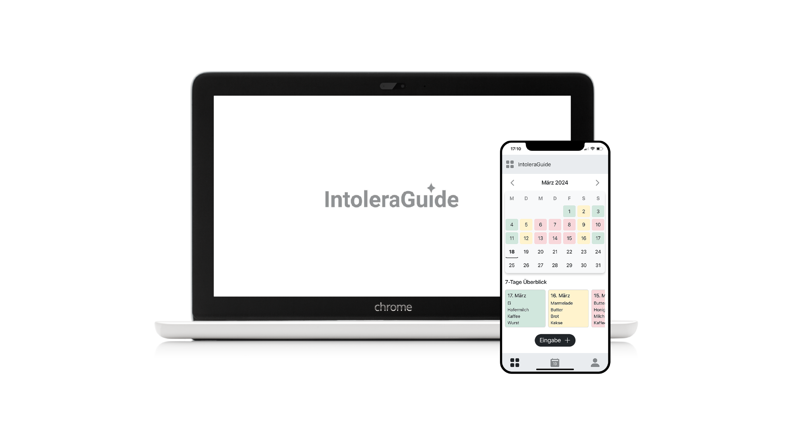
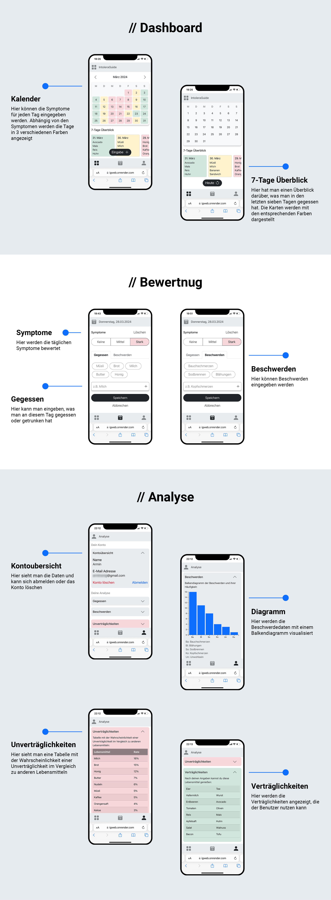
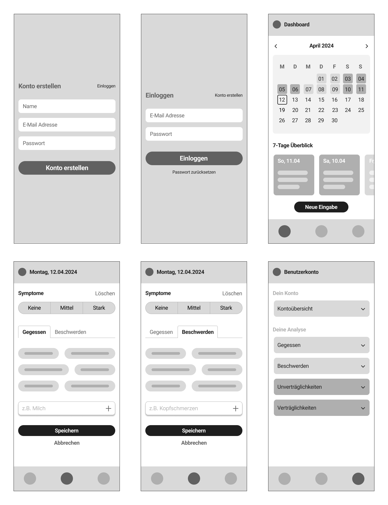
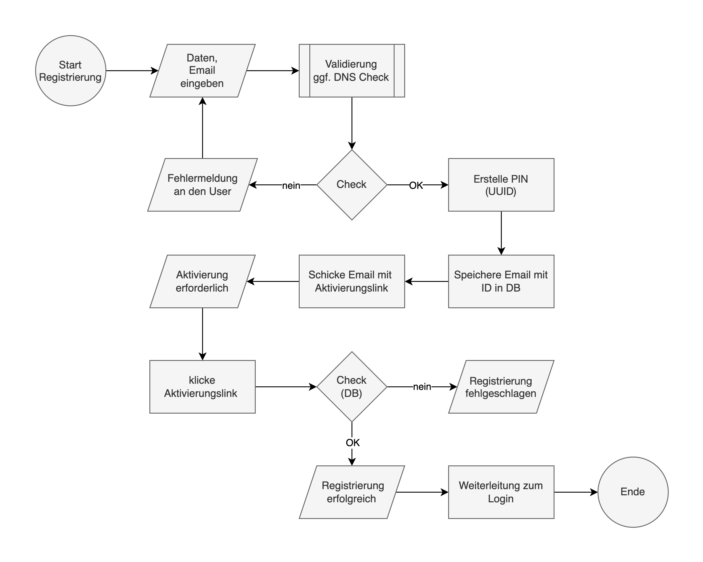

# IntoleraGuide App
Demo verfügbar unter https://igweb.onrender.com

## 1. Beschreibung

Dies ist mein Abschlussprojekt für die <b>Ausbildung zum geprüften Softwareentwickler</b> am WIFI Wien.

Laut Statistik leiden etwa <b>20% der Menschen</b> an irgendwelchen Unverträglichkeiten und meine Frau ist eine davon, also dachte ich mir, dass es Sinn macht, dieses Thema für das Projekt zu wählen. Also eine WebApp zu entwickeln, die diesen Menschen helfen kann.

Ziel ist es, die <b>Symptome</b> täglich zu verfolgen und Muster zwischen Ernährung und Symptomen zu erkennen. Durch die <b>Verarbeitung und Visualisierung der Daten</b> erhält der Nutzer einen Überblick über die Symptome sowie eine Liste seiner <b>Verträglichkeiten und Unverträglichkeiten</b>.

## 2. Features

### 2.1 Must Haves

1. **Symptom Tracker:**
- Tägliche Eingabemöglichkeit für Symptome im Kalenderformat
- Bewertung von Nahrungsmitteln in Bezug auf Symptome
- Möglichkeit, Muster zwischen Ernährung und Symptomen zu erkennen

2. **Datenbank:**
- Speicherung und Verwaltung von Nutzer-Daten und Eingaben (Gegessen, Beschwerden und Bewertungen)

3. **Benutzerkonto:**
- Schneller und einfacher Registrierungsprozess
- Möglichkeit, das Konto bzw. die Daten zu löschen

4. **Analyse:**
- Unverträglichkeiten und Verträglichkeiten tabellarisch/grafisch zu zeigen

### 2.2 Nice to Haves

1. **Experten Chat:**
- Direkte Kommunikation zwischen Nutzern und Experten (Sponsors)

2. **Berichte Herunterladen:**
- Möglichkeit, die Tagesberichte in einer Datei herunterzuladen

### 2.3 Not Haves

- Keine offline Funktionalität
- Keine medizinischen Diagnosen

## 3. Technologien

**Frontend:**
- HTML
- CSS
- JavaScript

**Backend:**
- Node.js
- Express.js

**Datenvisualisierung:**
- D3.js
  
**Datenbank:**
- MongoDB

**Sicherheit:**
- bcrypt
- dotenv

**Authentication:**
- cookie-session
- nodemailer
- OAuth 2.0

## 4. Screenshots

## 5. UI Wireframes

## 6. Flowchart (Konto Registrierung)

## 7. Infos

### 7.1 Die häufigsten Intoleranzen:

- Laktoseintoleranz
- Fruktoseintoleranz
- Glutenunverträglichkeit
- Histaminintoleranz

### 7.2 Nützliche Links:

- [Nahrungsmittel-Intoleranz](https://www.nahrungsmittel-intoleranz.com/)
- [Info Medizin](https://www.infomedizin.at/krankheiten/nahrungsmittelunvertraeglichkeit/)
- [Zentrum-der-Gesundheit](https://www.zentrum-der-gesundheit.de/krankheiten/allergien-intoleranzen/intoleranzen)
